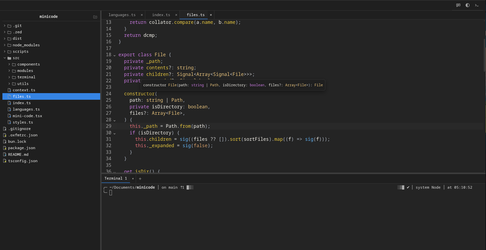

# minicode

A minimal IDE for the Web.



## Basic usage

```ts
import { MiniCode } from "@ncpa0cpl/minicode";
import { filesystem } from "./filesystem-api";

const minicode = MiniCode({
  filesystem,
  root: "/path/to/prject/dir",
});

document.body.append(minicode);
```

The `filesystem` is a required property that exposes an interface for interacting with the filesystem that contains
the project files. This interface is compatible with the Node.js `fs/promises` module.

## Syntax highlighting and LSP support

```ts
import { MiniCode } from "minicode";
import { javascript } from "@minicode/lang-javascript"
import { filesystem } from "./filesystem-api";

const minicode = MiniCode({
  filesystem,
  root: "/path/to/prject/dir",
  languages: [
    {
      // list of file extensions this config matches
      ext: [".ts"],
      // the codemirror compatible syntax extension
      spec: javascript({ typescript: true }),
      // an interface for sending and receiving messages with a Language Server Protocol
      lsp: () => {
        send(message: LspMessage): void {
          /** send implementation */
        },
        onMessage(handler: (message: LspMessage) => void): () => void {
          /** onMessage implementation */
        },
        close(): void {
          /** close implementation */
        },
      },
      // a formatter that can be used to format the files in this language
      fromatter: () => {
        return ({ code }) => prettier.format(code);
      },
      formatOnSave: true
    }
  ]
});

document.body.append(minicode);
```

The LSP, spec and the formatter are all optional. The `spec` gives the code editor the ability to parse the language and add syntax highlighting. LSP enables errors in editor, ability to jump to definitions, rename symbols, and hover tooltips etc. etc.

## Builtin terminal

```ts
import { MiniCode } from "minicode";
import { javascript } from "@minicode/lang-javascript";
import { filesystem } from "./filesystem-api";

const minicode = MiniCode({
  filesystem,
  root: "/path/to/prject/dir",
  terminal: ({ cols, rows }) => {
    return {
      start(): void | Promise<void> {
        // initiated a tty
      },
      write(data: string): void {
        // write to the stdin
      },
      onData(cb: (data: string) => void): () => void {
        // receive the stdout
      },
      resize(cols: number, rows: number): void {
        // request resize
      },
      dispose(): void {
        // de-initialize
      },
    };
  },
});

document.body.append(minicode);
```

When a terminal factory is provided it becomes possible to open an integrated terminal below the editor.
